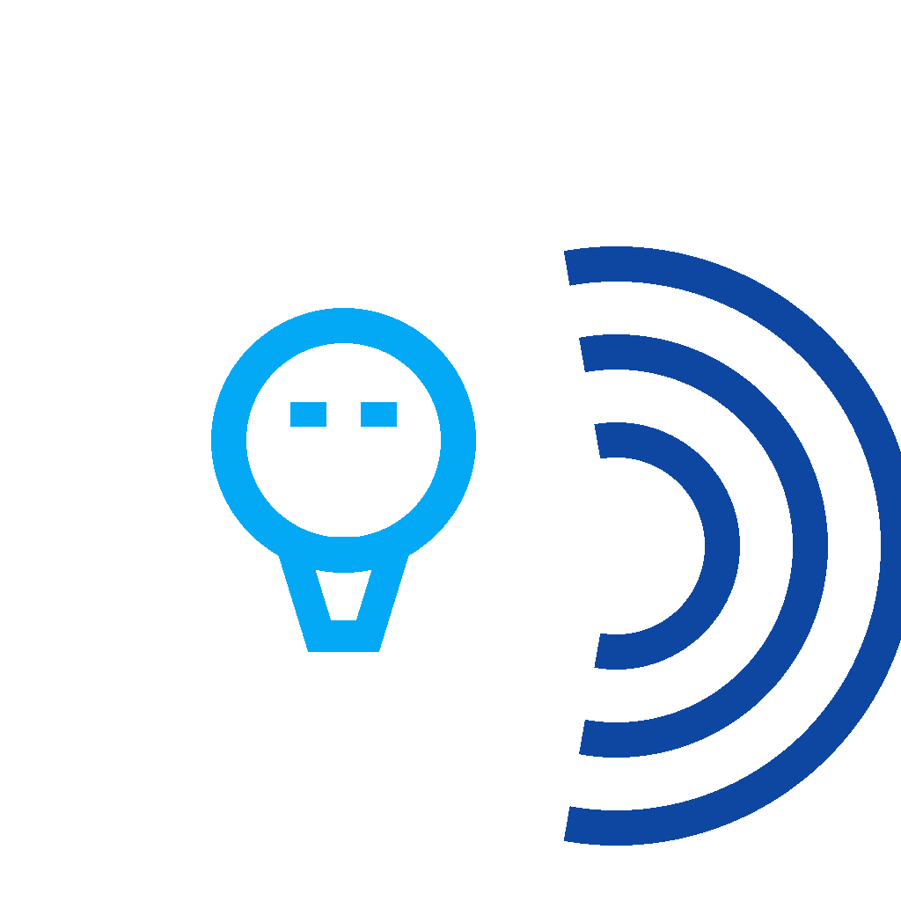

# Свет по движению
   
Кастомная интеграция для [Home Assistant](https://www.home-assistant.io) · версия **3.4.0**.

| | |
|---|---|
| Домен | `off_light` |
| Версия | 3.4.0 |
| Тип | custom integration |
## Описание
Автоматическое управление светом по движению.
### Возможности
- Сенсоры и мониторинг состояния
- Переключатели и вкл/выкл устройства
### Установка
1. Скопируйте папку `custom_components/off_light/` в каталог `custom_components/` конфигурации Home Assistant.
2. Перезапустите Home Assistant.
3. Настройки → Устройства и службы → Добавить интеграцию → **Свет по движению**.
> Установка через HACS: добавьте репозиторий `https://github.com/bezuglyy/off_light` как Custom repository (категория Integration).
---
## Description
Automatic light control by motion.
### Features
- Sensors and state monitoring
- Switches and on/off controls
### Installation
1. Copy the `custom_components/off_light/` folder into the `custom_components/` directory of your Home Assistant configuration.
2. Restart Home Assistant.
3. Settings → Devices & Services → Add Integration → **Свет по движению**.
> HACS: add `https://github.com/bezuglyy/off_light` as a Custom repository (category Integration).
---
**Автор / Author:**

## License / Лицензия
MIT
